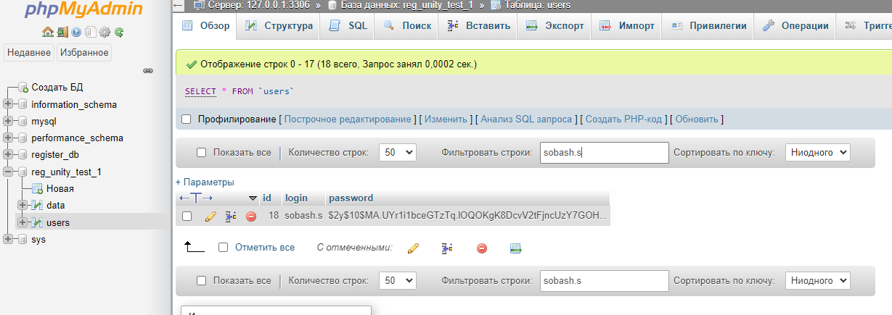
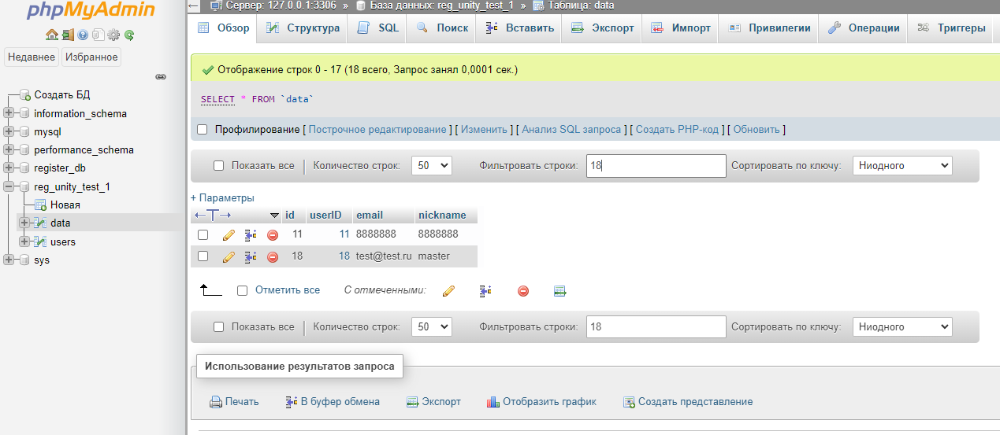
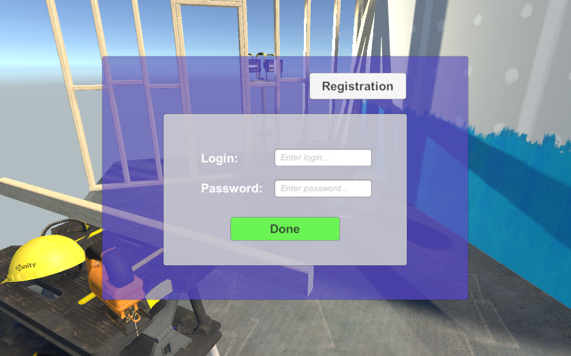
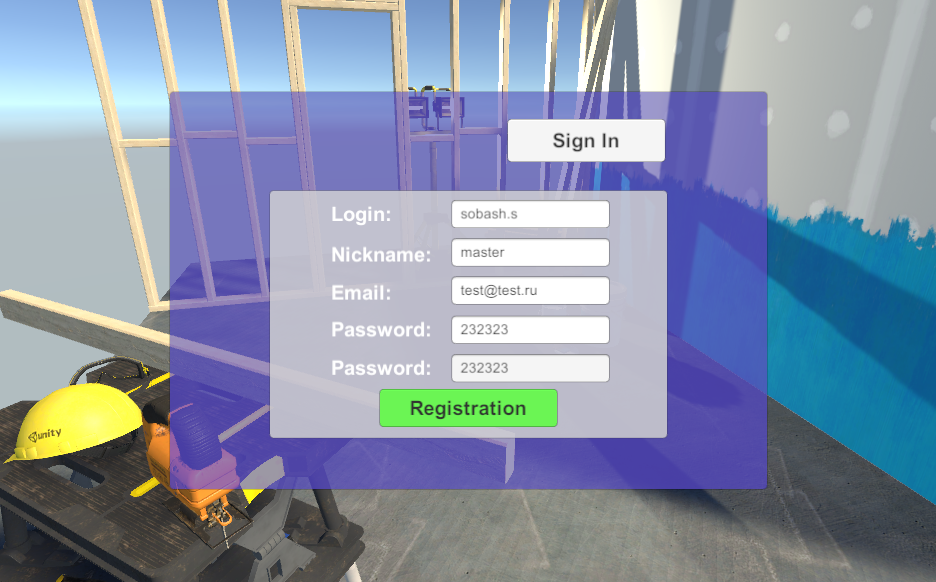
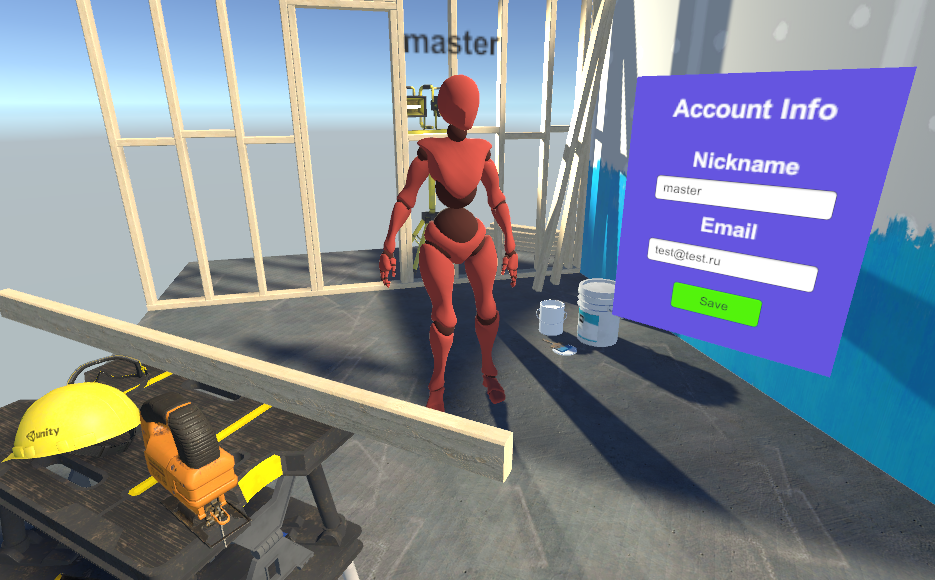

# DB_Registration_Unity
Database in dbtest folder 
 Итоги: 
 Было развернуто тестовое локальное окружение: 
 Open Server, версия MySQL-5.7, версия PHP_7.1, Версия Apache_2.4. 
 База находится по пути http://dbtest/ (127.0.0.1), хранит в себе 2 файла, db отвечает за авторизацию к базе, файл logreg отвечает за логику обмена данными из c# в саму базу. 

Реализовано:
0. Развернуто окружение.
1. Тестовая БД с ключом по id.
2. Окно входа\ввода логина.
3. Окно регистрации.
4. Проверка на правильность ввода данных + ошибка (общая)
5. Логика соединения и работы скриптов и БД
6. Лобби с отображением игрока и информацией о нем.
7. Возможность редактировать и перезаписывать инфо.
        </td>
<table>
    <tr>
        <td>
            
        </td>
        <td>
            
        </td>
        <td>
            
        </td>
        <td>
            
        </td>
        <td>
            
        </td>
        <td>  
    </tr>
</table> 
